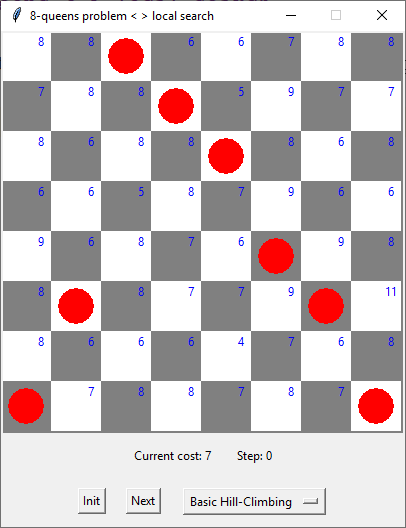

# 8-queens < > local search

> Demonstrate different local search algorithms applied to the 8-queens problem.



## Problem description

The goal of the 8-queens problem is to place 8 queens on a chessboard such that no queen attacks any other queen. A queen can attack any piece in the same row, same column or same diagonal.

Local search algorithms explore the state space with various techniques to find a goal state. In contrast to path-based search algorithms (such as breadth-first search or depth-first search) the path to the goal doesn't matter for local search algorithms.

## Implemented algorithms

 - [x] Basic Hill-Climbing
 - [x] Steepest Ascent Hill-Climbing
 - [x] Stochastic Hill-Climbing
 - [x] First-Choice (Stochastic) Hill-Climbing
 - [x] Simulated Annealing
 - [x] Local Beam Search
 - [ ] Stochastic Local Beam Search
 - [ ] Genetic Algorithm

## Usage

### Clone git repo

```bash
git clone https://github.com/stefanhuber/n-queens-problem.git
```

### Start main.py

Start the python program via command line from the project folder

```bash
python main.py
```
